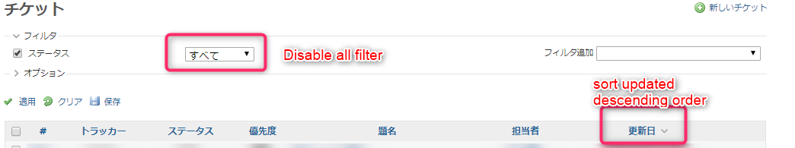
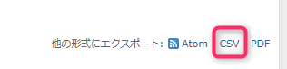
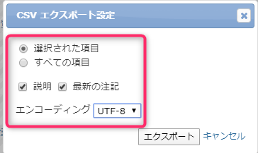
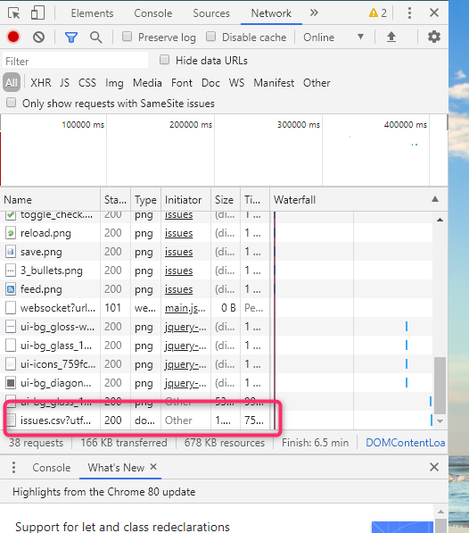
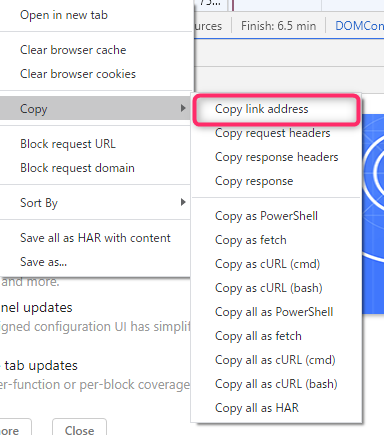

# redmine_slack_notify


[](LICENSE)
[](https://github.com/RichardLitt/standard-readme)
[](http://makeapullrequest.com)

The script that access the Redmine server in the private environment, detects ticket updates, and notifies Slack.

## Table of Contents

- [Background](#background)
- [Install](#install)
- [Usage](#usage)
- [API](#api)
- [Contributing](#contributing)
- [License](#license)

## Background


In the workplace where I work, I use Redmine built in a private environment for sharing information between stakeholders.

I wanted to share the update of Redmine Issue and its contents to Slack used by the development team,

Since Redmine server can only be accessed in a private environment, Slack's RSS Integration could not be used.

So, I thought about creating a Python script that runs on the PC (Raspberry PI) that was left behind in development, and notified Redmine of updates via the script.

## Install

### Precondition

- Python3.6 or more

### Install dependencies

```
pip install -r requirements.txt
```

### Edit your environment

```
mv .env.sample .env
vi .env
```

Config(.env)

```
URL=https:/xxxxxxx/xxxxxx/issues.csv                             # Endpoint that download issues.csv on your redmine server(!Check filter and must sort by updated DESC)
WEB_HOOK_URL_DAILY=https://hooks.slack.com/services/xxxxxx       # Incoming WEBHOOK for Daily notify
WEB_HOOK_URL_EACH=https://hooks.slack.com/services/xxxx          # Incoming WEBHOOK notify when detecting updating 
LOOP_INTERVAL=1       # Loop interval for detecting redmines updating
DAILY_HOUR=9          # Daily notify hours
DAILY_MINUTES=10      # Daily notify minutes (this examples sets 9:10)
```

#### [Note] How to get the URL for getting issue.csv

- First, Open Chrome developer tool(Push F12)
- Second, Show your project and **disabled all filter** and also **sort updated descending order**



- Click exporting other format CSV



- Choose the berow and click export
  - **selected columns**
  - check **description**, **latest note**
  - Encoding **UTF-8**
  


- Watch developer tool **network tab** and check downloading issues.csv

 

- select **Copy link address**, this is your issues.csv download URL!



## Usage

```
cd src 
python main.py
```

## Contributing

See [the contributing file](CONTRIBUTING.md)!

PRs accepted.

Small note: If editing the Readme, please conform to the [standard-readme](https://github.com/RichardLitt/standard-readme) specification.

## License

[MIT © tubone24.](LICENSE)
